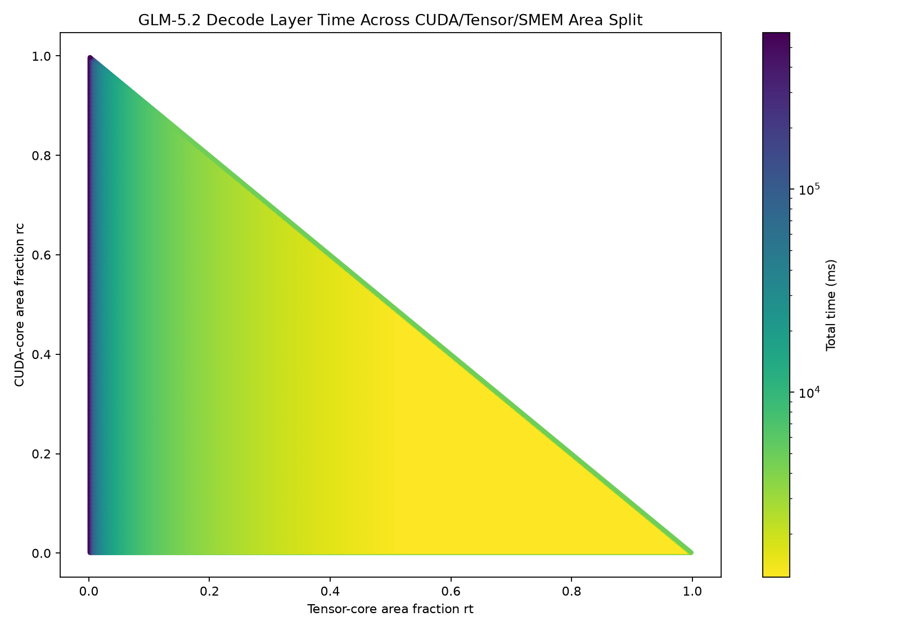
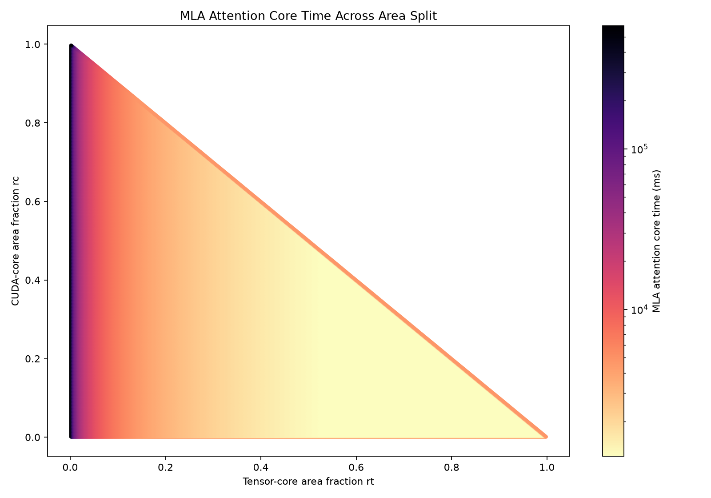

# Decode Layer Area-Balance Report

## Assumptions
1. Workload is 2048-batched GLM-5.2 **full decode layer**
    - pre-attention RMSNorm → MLA → residual add → pre-FFN RMSNorm → MoE FFN → residual add
    - Experts: 256
    - Router Top-K: 8
    - Hidden Size: 6144
    - MoE Intermediate Size: 2048
    - Attention: Multi-head Latent Attention (MLA), matrix-absorbed flash decode
        - Heads: 64
        - kv_lora_rank: 512
        - q_lora_rank: 2048
        - qk_nope_head_dim: 192, qk_rope_head_dim: 64, v_head_dim: 256
        - Cached latent per token: 512 + 64 = 576 elements
2. BF16 Weight, Activation & KV cache
3. Tokens are evenly distributed across experts
    - 64 tokens per expert
4. Sequence length (KV context): 1,048,576 tokens per sequence (GLM-5.2 max context)
    - Each of the 2048 batch sequences holds its own latent KV cache (dense MLA, no sparsity)
5. TSMC-12FFC logic node
    - 39.98 MTr/mm²
6. TSMC-N12-SHC SRAM node
    - 0.0864 μm²/bit
7. Transistor per CUDA core ≈ A100
    - 0.2 MTr per CUDA core
8. Transistor per Tensor core ≈ A100
    - 6.0 MTr per Tensor core
9. Compute Power per CUDA core ≈ A100
    - 5.64 GFLOP/s
10. Compute Power per Tensor core ≈ A100
    - 512 GFLOP/s
11. Clock Frequency ≈ A100
    - 1410 MHz
12. HBM Latency ≈ A100
    - 500 cycles
13. HBM Bandwidth
    - 2.04 TB/s
14. SwiGLU FLOPS per element: 8; softmax FLOPS per (head, position): 5

<!-- ## Formulas

```text
top_k = experts * tokens_per_expert / batch_tokens = 256 * 64 / 2048 = 8

rc = CUDA-core area fraction
rt = tensor-core area fraction
r_smem = 1 - rc - rt

A_cuda_core = 0.2e6 / 39.98 = 5002.501 um^2
A_tensor_core = 6.0e6 / 39.98 = 150075.038 um^2

cuda_cores = floor(rc * A_total / A_cuda_core)
tensor_cores = floor(rt * A_total / A_tensor_core)
smem_bytes = r_smem * A_total / A_bit / 8

cuda_roof = cuda_cores * 5.64e9
tensor_roof = tensor_cores * 512e9
```

```text
Standard GEMM:
ops = 2 * M * N * K
OI = ops / min_HBM_traffic
time = count * max(ops / tensor_roof, traffic / BW_eff)

Vector/reduction:
OI = ops / HBM_traffic
time = ops / min(cuda_roof, bw * OI)

MLA attention core (fused flash decode, KV cache streamed once):
tensor_ops = batch * 2 * heads * seq_len * (kv_latent + kv_lora_rank)
cuda_ops   = batch * softmax_flops * heads * seq_len
traffic    = batch * seq_len * kv_latent * bytes
time = max(tensor_ops / tensor_roof, cuda_ops / cuda_roof, traffic / BW_eff)

Latency-aware HBM (per-kernel num_stages C):
latency_seconds = 500 / 1.410e9 = 354.61 ns
W = buffer_bytes (one-stage tile working set)
C_best = min(floor(S_total / W), ceil(bw * latency / W))
BW_eff = min(bw, C_best * W / latency_seconds)
``` -->

## Workloads

| Stage | Kernel |
|---|---|
| Pre-attention RMSNorm | square-reduction |
| MLA Q down/up | mla_q_a GEMM, mla_q_b GEMM |
| MLA KV down (+RoPE key) | mla_kv_a GEMM |
| MLA absorb W_UK / W_UV | mla_wuk_absorb GEMM x64, mla_wuv_absorb GEMM x64 |
| MLA attention core | fused flash decode over 1,048,576 KV positions |
| MLA output proj | mla_o GEMM |
| Residual (post-attention) | residual add |
| Pre-FFN RMSNorm | square-reduction |
| Router | router GEMM |
| Up/Gate | up_gate GEMM x256 + SwiGLU |
| Down | down GEMM x256 |
| Expert combine | weighted sum over 2048 tokens, top-k=8 |
| Residual (post-FFN) | residual add |

| GEMM | Shape | Count | Ops |
|---|---:|---:|---:|
| mla_q_a | M=2048, N=2048, K=6144 | 1 | 51.540 GFLOP |
| mla_q_b | M=2048, N=16384, K=2048 | 1 | 137.439 GFLOP |
| mla_kv_a | M=2048, N=576, K=6144 | 1 | 14.499 GFLOP |
| mla_wuk_absorb | M=2048, N=512, K=192 | 64 | 25.770 GFLOP |
| mla_wuv_absorb | M=2048, N=256, K=512 | 64 | 34.360 GFLOP |
| mla_o | M=2048, N=6144, K=16384 | 1 | 412.317 GFLOP |
| router | M=2048, N=256, K=6144 | 1 | 6.442 GFLOP |
| up_gate | M=64, N=4096, K=6144 | 256 | 824.634 GFLOP |
| down | M=64, N=6144, K=2048 | 256 | 412.317 GFLOP |

| Attention core | Ops | HBM traffic | OI |
|---|---:|---:|---:|
| MLA flash decode (tensor QK+AV) | 299.049 TFLOP | 2304.266 GiB | 121.153 |
| MLA softmax (CUDA) | 0.687 TFLOP | on-chip (fused) | — |

| Vector/reduction | Ops | HBM traffic | OI |
|---|---:|---:|---:|
| pre-attention RMSNorm | 25.164 MFLOP | 24.008 MiB | 0.9996 |
| pre-FFN RMSNorm | 25.164 MFLOP | 24.008 MiB | 0.9996 |
| activation (SwiGLU) | 268.435 MFLOP | 192.000 MiB | 1.3333 |
| expert weighted sum | 188.744 MFLOP | 216.031 MiB | 0.8332 |
| post-attention residual add | 12.583 MFLOP | 72.000 MiB | 0.1667 |
| post-FFN residual add | 12.583 MFLOP | 72.000 MiB | 0.1667 |

## Graphs

| Total decode-layer time | MLA attention core time |
|---|---|
|  |  |

## Area Results

| Model | Workload | rc | rt | SMEM frac | SMEM MiB | CUDA cores | Tensor cores | Time | Throughput |
|---|---|---:|---:|---:|---:|---:|---:|---:|---:|
| Latency-aware | Decode layer | 0.018 | 0.975 | 0.007 | 1.316 | 490 | 885 | 1224.492 ms | 246.367 TFLOP/s |

The whole decode layer is essentially HBM-bandwidth bound: total HBM traffic 2326.16 GiB / 2.04 TB/s
≈ 1141 ms of the 1224 ms total, and the MLA attention core alone (2304.27 GiB KV-cache read) is
**99.0%** of the time. The optimal split puts almost all area in tensor cores (885), the minimum SMEM
that saturates HBM bandwidth (~1.3 MiB, `bw·latency` ≈ 706 KiB), and a small CUDA allotment (490) for
softmax and the vector stages.

## Stage Results

| Stage/group | Time | HBM | OI |
|---|---:|---:|---:|
| pre_attention_rmsnorm | 0.012 ms | 24.008 MiB | 1.000 |
| mla_q_a | 0.114 ms | 200.000 MiB | 245.760 |
| mla_q_b | 0.303 ms | 576.000 MiB | 227.556 |
| mla_kv_a | 0.032 ms | 53.250 MiB | 259.606 |
| mla_wuk_absorb (x64) | 0.097 ms | 188.000 MiB | 130.723 |
| mla_wuv_absorb (x64) | 0.107 ms | 208.000 MiB | 157.538 |
| **mla_attention (core)** | **1212.836 ms** | **2304.266 GiB** | **121.153** |
| mla_o | 0.910 ms | 1560.000 MiB | 252.062 |
| post_attention_residual_add | 0.037 ms | 72.000 MiB | 0.167 |
| rmsnorm_square_reduction | 0.012 ms | 24.008 MiB | 1.000 |
| router | 0.014 ms | 28.000 MiB | 219.429 |
| up_gate_x256 | 6.481 ms | 12608.000 MiB | 62.376 |
| down_x256 | 3.290 ms | 6400.000 MiB | 61.440 |
| expert_weighted_sum | 0.111 ms | 216.031 MiB | 0.833 |
| residual_add | 0.037 ms | 72.000 MiB | 0.167 |

MLA attention core breakdown at the best area node (bottleneck = **memory**):
tensor 660.018 ms, softmax/CUDA 248.659 ms, memory 1212.836 ms; num_stages = 40, BW_eff = 2.040 TB/s.
Note the FFN weight-streaming GEMMs (up_gate 6.48 ms, down 3.29 ms) are independent of batch — their
cost is reading the 256 experts' weights — so as batch/context grow the KV-cache-bound attention core
dominates ever more completely.

## Sensitivity Experiments

The area split is re-optimized (min total time) at each parameter value; all other parameters held at
baseline (bw 2.04 TB/s, latency 500 cyc, tensor 512 GFLOP/s/core, CUDA 5.64 GFLOP/s/core). "attnC" is
the MLA attention core's optimal num_stages (pipeline depth). The model is memory-bound, so **total
time tracks 1/bandwidth and is nearly insensitive to latency and core throughput.**

### Bandwidth Results
| HBM Bandwidth (TB/s) | attnC num_stages | Optimal SMEM (MiB) | Tensor cores | BW_eff (TB/s) | Total Run Time (ms) | Throughput (TFLOP/s) |
|---:|---:|---:|---:|---:|---:|---:|
| 1.02 | 20 | 4.325 | 879 | 1.020 | 2447.64 | 123.25 |
| 1.53 | 30 | 1.316 | 889 | 1.530 | 1632.20 | 184.83 |
| 2.04 | 40 | 1.316 | 885 | 2.040 | 1224.49 | 246.37 |
| 3.06 | 59 | 1.316 | 878 | 3.060 | 816.80 | 369.34 |
| 4.08 | 74 | 1.316 | 895 | 3.846 | 660.06 | 457.04 |

Total time scales as 1/bandwidth (time × bandwidth ≈ 2497 constant from 1.02→3.06 TB/s; equivalently
throughput is linear in bandwidth). The mild deviation at 4.08 TB/s is the only non-memory effect: at
the best node the SMEM budget (~1.3 MiB) caps num_stages at 74, so BW_eff saturates at 3.846 rather
than 4.08 TB/s (and the attention tensor roof, 660 ms, starts to matter) — i.e. past ~3 TB/s the
design must spend more area on SMEM to keep feeding the bandwidth.

### Latency Results
| HBM Latency (cycles) | attnC num_stages | Optimal SMEM (MiB) | Tensor cores | Total Run Time (ms) |
|---:|---:|---:|---:|---:|
| 250 | 20 | 0.752 | 888 | 1224.49 |
| 500 | 40 | 1.316 | 885 | 1224.49 |
| 1000 | 79 | 2.068 | 881 | 1224.50 |
| 2000 | 157 | 3.385 | 875 | 1224.51 |
| 4000 | 314 | 5.829 | 863 | 1224.53 |

Latency has essentially no effect (+0.04 ms over a 16× range): the optimizer hides more latency by
deepening the pipeline (num_stages 20→314) and buying proportionally more SMEM (0.75→5.83 MiB), trading
a handful of tensor cores (888→863) while BW_eff stays pinned at 2.040 TB/s.

### Tensor-core Throughput Results
| Tensor GFLOP/s/core | Optimal SMEM (MiB) | CUDA cores | Tensor cores | Total Run Time (ms) | Throughput (TFLOP/s) |
|---:|---:|---:|---:|---:|---:|
| 256 | 0.752 | 108 | 900 | 1312.42 | 229.86 |
| 384 | 1.316 | 490 | 885 | 1224.95 | 246.27 |
| 512 | 1.316 | 490 | 885 | 1224.49 | 246.37 |
| 768 | 2.068 | 490 | 881 | 1224.04 | 246.46 |
| 1024 | 4.137 | 490 | 871 | 1223.82 | 246.50 |

Nearly flat. Halving tensor throughput to 256 GFLOP/s is the only visible change (+7%, 1312 ms): the
attention QK/AV and FFN GEMMs briefly become compute-bound, and the optimizer maxes tensor cores (900)
at the expense of CUDA cores. At and above baseline, total time is unchanged (memory-bound).

### CUDA-core Throughput Results
| CUDA GFLOP/s/core | Optimal SMEM (MiB) | CUDA cores | Tensor cores | Total Run Time (ms) | Throughput (TFLOP/s) |
|---:|---:|---:|---:|---:|---:|
| 2.82 | 1.316 | 953 | 870 | 1224.52 | 246.36 |
| 4.23 | 1.504 | 653 | 879 | 1224.50 | 246.36 |
| 5.64 | 1.316 | 490 | 885 | 1224.49 | 246.37 |
| 8.46 | 1.316 | 326 | 890 | 1224.48 | 246.37 |
| 11.28 | 1.316 | 245 | 893 | 1224.48 | 246.37 |

No effect (±0.04 ms). Softmax and the vector stages are a negligible fraction of the layer; the
optimizer simply reallocates CUDA↔tensor area (953→245 CUDA cores) with no change in total time.

## Batch-Size = 1 Bottleneck Analysis

Repeating the sweeps at **batch = 1** (single sequence, seq_len 1,048,576). A single sequence carries a
1.15 GiB latent KV cache, and the per-expert GEMMs now compute only 16 padded rows (M padded from 1 to
16, tensor core underutilized) while still streaming full weight matrices — so the layer is far smaller
and more balanced than the 2048-batch case.

### Baseline (batch 1): 1.0565 ms, 2.007 GiB HBM, 152.73 TFLOP/s

| Part | Time | Share | Regime |
|---|---:|---:|---|
| MLA attention core | 0.5922 ms | 56.1% | memory ≈ tensor (mem 0.592, tensor 0.591, cuda 0.121 ms) |
| FFN + MLA GEMMs | 0.4642 ms | 43.9% | memory-bound weight streaming (OI ≈ 16 FLOP/byte) |
| vector / norms | ~0.0002 ms | 0.0% | — |

Dominant GEMMs: up_gate 0.199 ms (386.5 MiB, OI 15.9), down 0.100 ms (194.0 MiB, OI 15.8), mla_o
0.099 ms (192.7 MiB, OI 15.9). Their operational intensity is ~16 (reading full expert/projection
weights to produce only 16 rows), so they are purely bandwidth-bound. At the optimal split the analyzer
picks just enough tensor cores (482) that the attention QK/AV compute time (0.591 ms) equals its
KV-cache read time (0.592 ms) — the attention core sits exactly on the memory/compute knife-edge.

### Bandwidth Results (batch 1)
| HBM Bandwidth (TB/s) | attnC num_stages | Optimal SMEM (MiB) | Tensor cores | Total Run Time (ms) | Throughput (TFLOP/s) |
|---:|---:|---:|---:|---:|---:|
| 1.02 | 20 | 136.332 | 241 | 2.1130 | 76.36 |
| 1.53 | 30 | 110.382 | 362 | 1.4087 | 114.55 |
| 2.04 | 40 | 84.808 | 482 | 1.0565 | 152.73 |
| 3.06 | 59 | 33.096 | 723 | 0.7043 | 229.09 |
| 4.08 | 79 | 1.504 | 894 | 0.5514 | 292.66 |

Total time is inversely proportional to bandwidth (throughput linear in bandwidth) up to ~3 TB/s. Past
that, the attention core — which starts critically balanced — tips compute-bound: at 4.08 TB/s the
optimizer swings almost all area into tensor cores (894) and throughput (292.7) falls below the linear
extrapolation.

### Latency Results (batch 1)
| HBM Latency (cycles) | attnC num_stages | Optimal SMEM (MiB) | Total Run Time (ms) |
|---:|---:|---:|---:|
| 250 | 20 | 84.808 | 1.0565 |
| 500 | 40 | 84.808 | 1.0565 |
| 1000 | 79 | 84.808 | 1.0565 |
| 2000 | 157 | 84.808 | 1.0565 |
| 4000 | 314 | 84.808 | 1.0565 |

No effect: deeper pipelining (num_stages 20→314) hides the added latency; BW_eff stays at 2.040 TB/s.
(With so little compute to feed, the "best" SMEM balloons to ~85 MiB — leftover area dumped into SMEM in
a flat region of the landscape; it does not change the time.)

### Tensor-core Throughput Results (batch 1)
| Tensor GFLOP/s/core | Optimal SMEM (MiB) | Tensor cores | Total Run Time (ms) | Throughput (TFLOP/s) |
|---:|---:|---:|---:|---:|
| 256 | 0.752 | 900 | 1.0985 | 146.89 |
| 384 | 51.336 | 643 | 1.0565 | 152.73 |
| 512 | 84.808 | 482 | 1.0565 | 152.73 |
| 768 | 117.904 | 322 | 1.0565 | 152.73 |
| 1024 | 134.640 | 241 | 1.0565 | 152.73 |

Flat above baseline; **+4% at ×0.5** (256 GF/s → 1.0985 ms). Because the attention core is balanced at
baseline, halving tensor throughput tips its QK/AV compute-bound — unlike the 2048-batch case, tensor
throughput now matters at the margin.

### CUDA-core Throughput Results (batch 1)
| CUDA GFLOP/s/core | Optimal SMEM (MiB) | CUDA cores | Total Run Time (ms) |
|---:|---:|---:|---:|
| 2.82 | 81.423 | 980 | 1.0565 |
| 5.64 | 84.808 | 490 | 1.0565 |
| 11.28 | 86.500 | 245 | 1.0565 |

No effect — softmax and the vector stages are negligible.

**Verdict (batch 1): still HBM-bandwidth bound.** Time tracks 1/bandwidth; latency and CUDA throughput
do nothing. The difference from batch 2048 is only one of degree: attention is 56% (not 99%) of the
layer and sits exactly at the memory/compute crossover, so tensor throughput has a small (+4%) effect
below baseline, and raising bandwidth past ~3 TB/s would flip the attention core into a compute
bottleneck.

## Conclusion

The GLM-5.2 decode layer is **HBM-bandwidth bound across the batch range**. At 2048 batch / 1M context
it is overwhelmingly so: total time is inversely proportional to bandwidth (throughput linear in
bandwidth) and essentially invariant to HBM latency, tensor-core throughput, and CUDA-core throughput,
because the MLA per-sequence KV cache (2.3 TiB read per step across the batch) dwarfs every compute
term. At batch 1 the layer is far smaller (2.0 GiB HBM) and more balanced — ~56% attention (sitting on
the memory/compute knife-edge) and ~44% memory-bound weight streaming — but bandwidth is still the
governing bottleneck; only there does tensor throughput matter at the margin. The only way to reduce
decode time in either regime is more HBM bandwidth (or shrinking traffic — lower-precision / sparse KV,
larger real per-expert tiles); adding compute or reducing latency does not help.
