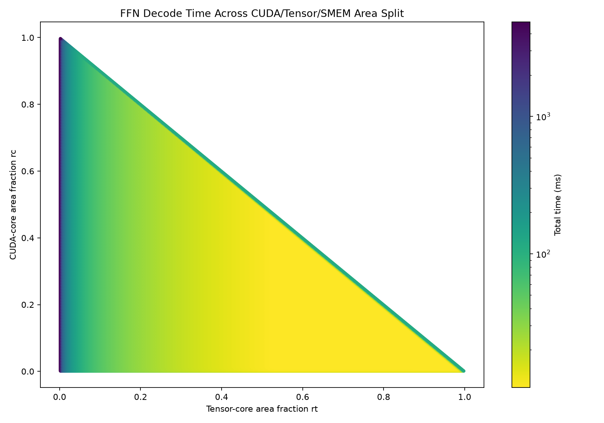
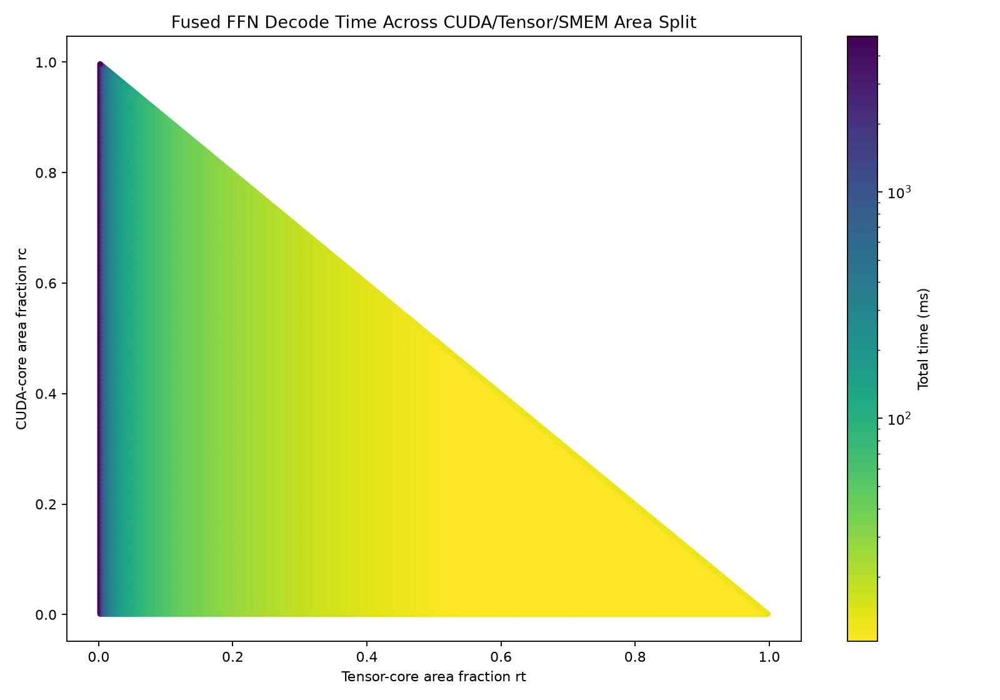

# Decode FFN Area-Balance Report

## Assumptions
1. Workload is 4096-batched GLM-5.2
    - Experts: 256
    - Router Top-K: 8
    - Hidden Size: 6144
    - Intermediate Size: 2048
2. BF16 Weight & Activation
3. Tokens are evenly distributed across experts
    - 128 tokens per expert
4. TSMC-12FFC logic node
    - 39.98 MTr/mm²
5. TSMC-N12-SHC SRAM node
    - 0.0864 μm²/bit
6. Transistor per CUDA core ≈ A100
    - 0.2 MTr per CUDA core
7. Transistor per Tensor core ≈ A100
    - 6.0 MTr per Tensor core
8. Compute Power per CUDA core ≈ A100
    - 5.64 GFLOP/s
9. Compute Power per Tensor core ≈ A100
    - 512 GFLOP/s
10. Clock Frequency ≈ A100
    - 1410 MHz
11. HBM Latency ≈ A100
    - 500 cycles
12. SwiGLU FLOPS per element: 8

<!-- ## Formulas

```text
top_k = experts * tokens_per_expert / batch_tokens = 256 * 128 / 4096 = 8

rc = CUDA-core area fraction
rt = tensor-core area fraction
r_smem = 1 - rc - rt

A_cuda_core = 0.2e6 / 39.98 = 5002.501 um^2
A_tensor_core = 6.0e6 / 39.98 = 150075.038 um^2

cuda_cores = floor(rc * A_total / A_cuda_core)
tensor_cores = floor(rt * A_total / A_tensor_core)
smem_bytes = r_smem * A_total / A_bit / 8

cuda_roof = cuda_cores * 5.64e9
tensor_roof = tensor_cores * 512e9
```

```text
Standard GEMM:
ops = 2 * M * N * K
OI = ops / min_HBM_traffic
time = ops / min(tensor_roof, bw * OI)

Vector/reduction:
OI = ops / HBM_traffic
time = ops / min(cuda_roof, bw * OI)

Fused GEMM epilogue:
time = max(tensor_ops / tensor_roof,
           cuda_epilogue_ops / cuda_roof,
           fused_HBM_traffic / bw)

Latency-aware HBM (per-kernel num_stages C):
latency_seconds = 500 / 1.410e9 = 354.61 ns
W = buffer_bytes (one-stage tile working set)
C_best = min(floor(S_total / W), ceil(bw * latency / W))
BW_eff = min(bw, C_best * W / latency_seconds)
time = count * max(ops / tensor_roof, traffic / BW_eff)
``` -->

## Workloads

| Stage | Unfused | Fused |
|---|---|---|
| RMSNorm | square-reduction | square-reduction |
| Router | router GEMM | router + RMS-scale |
| Up/Gate | up_gate GEMM x256 + SwiGLU | up_gate + RMS-scale + SwiGLU x256 |
| Down | down GEMM x256 | down GEMM x256 |
| Expert combine | weighted sum over 4096 tokens, top-k=8 | same |
| Output | residual add | same |

| GEMM | Shape | Count | Ops |
|---|---:|---:|---:|
| router | M=4096, N=256, K=6144 | 1 | 12.885 GFLOP |
| up_gate | M=128, N=4096, K=6144 | 256 | 1649.267 GFLOP |
| down | M=128, N=6144, K=2048 | 256 | 824.634 GFLOP |

| Vector/reduction | Ops | HBM traffic | OI |
|---|---:|---:|---:|
| RMSNorm square-reduction | 50.328 MFLOP | 48.016 MiB | 0.9996 |
| activation | 536.871 MFLOP | 384.000 MiB | 1.3333 |
| expert weighted sum | 377.487 MFLOP | 432.062 MiB | 0.8332 |
| residual add | 25.166 MFLOP | 144.000 MiB | 0.1667 |

## Graphs

| Original roofline | Latency-aware roofline |
|---|---|
|  |  |
|  |  |

## Area Results

| Model | Workload | rc | rt | SMEM frac | SMEM MiB | CUDA cores | Tensor cores | Time | Throughput |
|---|---|---:|---:|---:|---:|---:|---:|---:|---:|
| Original | Unfused | 0.018 | 0.970 | 0.012 | 2.257 | 490 | 880 | 10.613 ms | 234.406 TFLOP/s |
| Original | Fused | 0.014 | 0.974 | 0.012 | 2.257 | 381 | 884 | 10.350 ms | 240.382 TFLOP/s |
| Latency-aware | Unfused | 0.018 | 0.970 | 0.012 | 2.257 | 490 | 880 | 10.613 ms | 234.406 TFLOP/s |
| Latency-aware | Fused | 0.014 | 0.974 | 0.012 | 2.257 | 381 | 884 | 10.350 ms | 240.382 TFLOP/s |

| Comparison | Time ratio | Throughput ratio | SMEM MiB ratio |
|---|---:|---:|---:|
| Fused vs. unfused, original | 1.0254x faster | 1.0255x higher | 1.000x |
| Fused vs. unfused, latency-aware | 1.0254x faster | 1.0255x higher | 1.000x |
| Latency-aware vs. original, unfused | 1.0000x | 1.0000x | 1.000x |
| Latency-aware vs. original, fused | 1.0000x | 1.0000x | 1.000x |

## Stage Results

| Stage/group | Unfused time | Fused time | Unfused HBM | Fused HBM | Unfused OI | Fused OI |
|---|---:|---:|---:|---:|---:|---:|
| RMSNorm square-reduction | 0.025 ms | 0.025 ms | 48.016 MiB | 48.016 MiB | 1.000 | 1.000 |
| router / router_rms_scale | 0.029 ms | 0.028 ms | 53.000 MiB | 53.008 MiB | 231.849 | 231.834 |
| up_gate + activation / up_gate_rms_swiglu | 6.842 ms | 6.579 ms | 13312.000 MiB | 12800.062 MiB | 121.663 | 122.929 |
| down_x512 | 3.421 ms | 3.421 ms | 6656.000 MiB | 6656.000 MiB | 118.154 | 118.154 |
| expert_weighted_sum | 0.222 ms | 0.222 ms | 432.062 MiB | 432.062 MiB | 0.833 | 0.833 |
| residual_add | 0.074 ms | 0.074 ms | 144.000 MiB | 144.000 MiB | 0.167 | 0.167 |

| Fused stage/group | Saved HBM | Time saved | Speedup |
|---|---:|---:|---:|
| router_rms_scale | -0.008 MiB | 0.000 ms | 1.005x |
| up_gate_rms_swiglu | 511.938 MiB | 0.263 ms | 1.040x |
| down + weighted sum + residual | 0.000 MiB | 0.000 ms | 1.000x |

## Latency-Aware Stage Results

| Stage/group | Unfused time | Fused time | Unfused HBM | Fused HBM | Unfused OI | Fused OI |
|---|---:|---:|---:|---:|---:|---:|
| RMSNorm square-reduction | 0.025 ms | 0.025 ms | 48.016 MiB | 48.016 MiB | 1.000 | 1.000 |
| router / router_rms_scale | 0.029 ms | 0.028 ms | 53.000 MiB | 53.008 MiB | 231.849 | 231.834 |
| up_gate + activation / up_gate_rms_swiglu | 6.842 ms | 6.579 ms | 13312.000 MiB | 12800.062 MiB | 121.663 | 122.929 |
| down_x512 | 3.421 ms | 3.421 ms | 6656.000 MiB | 6656.000 MiB | 118.154 | 118.154 |
| expert_weighted_sum | 0.222 ms | 0.222 ms | 432.062 MiB | 432.062 MiB | 0.833 | 0.833 |
| residual_add | 0.074 ms | 0.074 ms | 144.000 MiB | 144.000 MiB | 0.167 | 0.167 |

## Latency Results
| HBM Latency (cycles) | Optimal num_stages | Optimal SMEM (MiB) | Total Run Time (ms) |
|---|---:|---:|---:|
| 500 | 1 | 2.257 | 10.61 |
| 1000 | 2 | 2.633 | 10.61 |
| 2000 | 3 | 3.573 | 10.61 |
| 4000 | 5 | 6.582 | 10.61 |
| 8000 | 10 | 11.471 | 10.61 |
| 16000 | 20 | 22.941 | 10.62 |
| 32000 | 40 | 45.507 | 10.62 |
| 64000 | 77 | 87.065 | 10.88 |

## Bandwidth Results
| HBM Bandwidth (TB/s) | Optimal num_stages | Optimal SMEM (MiB) | Total Run Time (ms) |
|---|---:|---:|---:|
| 1 | 1 | 92.518 | 21.65 |
| 2.04 | 1 | 2.257 | 10.61 |
| 4 | 3 | 1.880 | 5.85 |
| 8 | 5 | 1.504 | 5.79 |