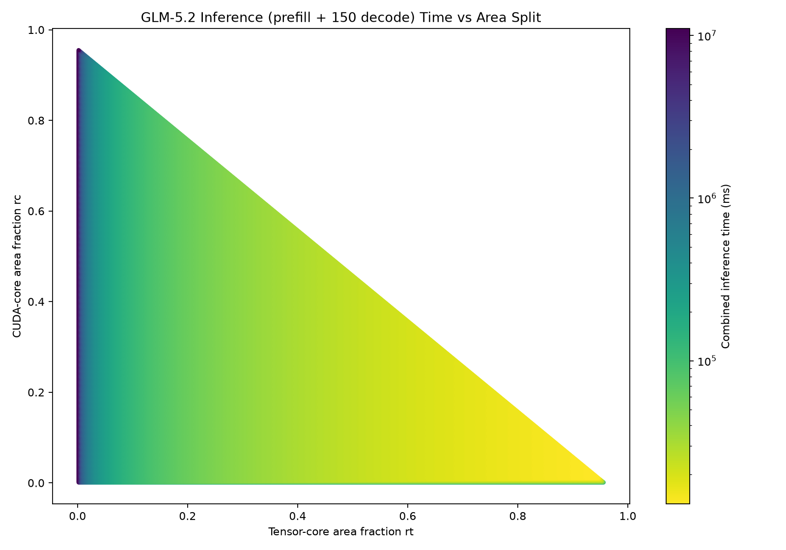

# Inference (Prefill + Decode) Layer Area-Balance Report

## Assumptions
1. One GLM-5.2 transformer layer running an **end-to-end inference**: prefill the prompt once, then
   decode tokens autoregressively on the **same fixed die** (the chip is designed once for both stages)
    - Prompt length (prefill): **1,048,576 tokens** (GLM-5.2 max context)
    - Decode: **150 tokens** (global `DECODE_TOKENS`, tunable), batch = 1
    - KV context grows 1,048,576 → 1,048,725 across the 150 decode steps
2. Stage models (see `prefill_area_report.md`, `decode_ffn_area_report.md` / decode analysis):
    - **Prefill**: MLA + DeepSeek Sparse Attention (DSA, `index_topk` 2048), K/V materialized; compute
      (tensor) bound. ≈ 13.0 s/layer.
    - **Decode**: absorbed MLA, **dense** over the KV cache (reads the full context each step); HBM
      bandwidth bound. ≈ 1.06 ms/token at 1M context. (DSA-decode would be a cheaper refinement.)
3. Even MoE routing, 256 experts, top-8; GLM-5.2 MLA dims (64 heads, kv_lora 512, q_lora 2048,
   qk_nope 192, qk_rope 64, v_head 256). BF16.
4. A100-like cores: 0.2 / 6.0 MTr per CUDA / tensor core; 5.64 / 512 GFLOP/s per CUDA / tensor core;
   1410 MHz; HBM 500 cycles latency, 2.04 TB/s bandwidth. TSMC-12FFC logic, N12-SHC SRAM.

<!-- ## Formulas

```text
inference_time(area) = prefill_time(area) + sum_{t=0..N-1} decode_step_time(area, S+t)

Both stage models share the same chip constants and area grid (rc, rt, r_smem), so their per-node
time arrays line up element-wise.  Decode attention time is exactly linear in context length (compute
and memory both scale with the number of KV positions), so the growing steps sum analytically:

  decode_step_time(c) = decode_base + decode_attention(S) * c / S    (decode_base is context-independent)
  sum_{t=0..N-1} decode_step_time(S+t) = N*decode_base + decode_attention(S) * (N + N(N-1)/(2S))

The single area split minimizing inference_time over the grid is the reported optimum.
```
-->

## Workloads

| Stage | Runs | Attention | Dominant cost | Bottleneck |
|---|---|---|---|---|
| Prefill | once | causal self-attention + DSA (top-2048) over 1,048,576 tokens | lightning indexer O(S²), MoE GEMMs (M=32768) | tensor (compute) |
| Decode | ×150 | absorbed MLA, dense read of the KV cache | KV-cache streaming (~1.15 GiB/step) | HBM bandwidth |

Per-run magnitudes: prefill ≈ 5.65 PFLOP / 13.0 s; decode ≈ 0.16 TFLOP / 1.06 ms per token. Prefill is
~8,200× the work of one decode step, so ~12,300 decode tokens are needed before decode equals prefill.

## Graphs

| Combined inference time vs. area split |
|---|
|  |

## Area Results

| Model | Workload | rc | rt | SMEM frac | SMEM MiB | CUDA cores | Tensor cores | Time | Throughput |
|---|---|---:|---:|---:|---:|---:|---:|---:|---:|
| Latency-aware | Prefill + 150 decode | 0.012 | 0.945 | 0.043 | 8.086 | 326 | 858 | 13,150.9 ms | 431.123 TFLOP/s |

The combined-optimal split is **identical to the prefill-optimal split** (tensor-heavy: 858 tensor / 326
CUDA cores, ~8 MiB SMEM). Prefill is 98.8% of the inference time, so it governs the design; the layer
runs at ~431 TFLOP/s, essentially the tensor roof.

## Stage Results

| Stage | Time | Share |
|---|---:|---:|
| Prefill (once, DSA) | 12,992.4 ms | 98.8% |
| Decode ×150 (1.0566 ms/token) | 158.5 ms | 1.2% |
| **Total inference** | **13,150.9 ms** | |

### Which stage governs the shared design?
The chip is built once. Evaluating the combined time at each stage's standalone-optimal split:

| Design point | Combined time | (prefill + decode) | vs. best |
|---|---:|---:|---:|
| **prefill-optimal split** (858 tensor) | 13,150.9 ms | 12,992.4 + 158.5 | **+0.00%** |
| decode-optimal split (482 tensor, 85 MiB SMEM) | 23,117.3 ms | 22,958.8 + 158.5 | +75.78% |
| combined-optimal split | 13,150.9 ms | 12,992.4 + 158.5 | +0.00% |

**Decode is indifferent to the area split**: its time is 158.488 ms at the prefill-optimal split vs
158.484 ms at the decode-optimal split. Decode's bottleneck is HBM bandwidth — a fixed chip resource,
**not** part of the rc/rt/SMEM area budget — and it needs only ~1 MiB SMEM to saturate that bandwidth,
which every split provides. So decode never competes for area, while prefill strongly wants tensor
cores. Designing for decode instead would starve prefill of tensor cores and cost +76%.

## Sensitivity Experiments

Area split re-optimized at each parameter value (parameter applied to **both** stages); baseline
bw 2.04 TB/s, latency 500 cyc, tensor 512 GFLOP/s/core, CUDA 5.64 GFLOP/s/core. Prefill dominates, so
the combined load behaves like prefill (compute/tensor bound); the only bandwidth sensitivity comes
from the 1.2% decode tail.

### Bandwidth Results
| HBM Bandwidth (TB/s) | Tensor cores | prefill (ms) | decode (ms) | Total (ms) | Throughput (TFLOP/s) |
|---:|---:|---:|---:|---:|---:|
| 1.02 | 858 | 13,130 | 317.0 | 13,447.3 | 421.62 |
| 2.04 | 858 | 12,992 | 158.5 | 13,150.9 | 431.12 |
| 4.08 | 858 | 12,969 | 84.7 | 13,053.8 | 434.33 |

Small (~1.5% over 4×). Decode scales as 1/bandwidth (317 → 84.7 ms) but is only 1–2% of the total;
prefill (compute-bound) barely moves. The bandwidth sensitivity **grows with the decode length** (see
tuning below) — at generation-heavy workloads bandwidth would matter.

### Latency Results
| HBM Latency (cycles) | Total (ms) |
|---:|---:|
| 500 | 13,150.9 |
| 2000 | 13,150.9 |
| 4000 | 13,150.9 |

No effect (both stages hide latency by pipelining).

### Tensor-core Throughput Results
| Tensor GFLOP/s/core | CUDA cores | Tensor cores | Total (ms) | Throughput (TFLOP/s) |
|---:|---:|---:|---:|---:|
| 256 | 272 | 860 | 25,934.6 | 218.61 |
| 384 | 272 | 860 | 17,404.6 | 325.76 |
| 512 | 326 | 858 | 13,150.9 | 431.12 |
| 768 | 463 | 853 | 8,909.4 | 636.37 |
| 1024 | 626 | 848 | 6,799.1 | 833.88 |

**Total time is inversely proportional to tensor throughput** (throughput linear: 219 → 834 TFLOP/s) —
the governing knob, inherited from prefill. Decode is unaffected (158.5 ms throughout).

### CUDA-core Throughput Results
| CUDA GFLOP/s/core | CUDA cores | Tensor cores | Total (ms) |
|---:|---:|---:|---:|
| 2.82 | 626 | 848 | 13,305.6 |
| 5.64 | 326 | 858 | 13,150.9 |
| 11.28 | 163 | 863 | 13,076.7 |

Nearly flat (±1%) — the indexer gate / softmax run on CUDA cores but are cheaply rebalanced.

## Decode-Tokens Tuning

Sweeping `DECODE_TOKENS` (batch 1). Does generating more tokens ever pull the shared design toward
decode?

| Decode tokens | Total (ms) | prefill % | decode % | Optimal rt | Tensor cores | per-token (ms) |
|---:|---:|---:|---:|---:|---:|---:|
| 150 | 13,151 | 98.8% | 1.2% | 0.945 | 858 | 1.0566 |
| 1,000 | 14,049 | 92.5% | 7.5% | 0.945 | 858 | 1.0568 |
| 10,000 | 23,586 | 55.1% | 44.9% | 0.945 | 858 | 1.0594 |
| 100,000 | 121,470 | 10.7% | 89.3% | 0.945 | 858 | 1.0848 |
| 1,000,000 | 1,351,920 | 1.0% | 99.0% | 0.945 | 858 | 1.3389 |

Prefill and decode reach parity around ~12,000 tokens. But **the optimal area split never changes** —
it stays tensor-heavy (rt 0.945, 858 tensor cores) even when decode is 99% of the time, because decode
is indifferent to the split. Increasing decode length shifts *where the time goes* and raises the
bandwidth sensitivity, but not *how the silicon should be partitioned*. (Per-token time creeps up
1.057 → 1.339 ms as the KV context grows from 1M to ~2M.)

## Conclusion

For end-to-end single-layer inference, **prefill governs the die-area design**: the optimal split is the
tensor-heavy prefill optimum (858 tensor / 326 CUDA cores, ~8 MiB SMEM), and it is invariant to the
number of decode tokens. Total time is compute (tensor-throughput) bound, insensitive to HBM latency,
and only weakly sensitive to bandwidth (via the decode tail, growing with generation length). The
reason decode never claims area is structural: its bottleneck is HBM bandwidth — a fixed resource not
traded in the rc/rt/SMEM split — and it saturates that bandwidth with ~1 MiB SMEM that any split
provides. So the design rule is: **partition silicon for prefill (maximize tensor cores); decode rides
along for free.** More decode-heavy or DSA-decode workloads change the time split and the value of HBM
bandwidth, but not this partitioning.

**Three regimes on the same GLM-5.2 layer / 1M context:**

| | Decode (batch 2048) | Prefill (1 prompt, DSA) | Inference (prefill + 150 decode) |
|---|---|---|---|
| Bottleneck | HBM bandwidth | Tensor throughput | **Tensor throughput** (prefill-governed) |
| Time ∝ | 1 / bandwidth | 1 / tensor-throughput | 1 / tensor-throughput |
| Optimal split | flat (any SMEM ≥ ~1 MiB) | tensor-heavy (rt 0.94) | **tensor-heavy (rt 0.945)** |
| Layer / step time | 1.22 s (batch 2048) | 13.0 s | 13.15 s |
| Throughput | 246 TFLOP/s | 435 TFLOP/s | 431 TFLOP/s |
