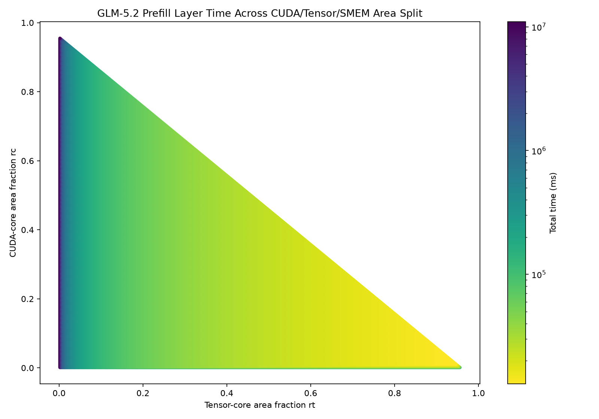
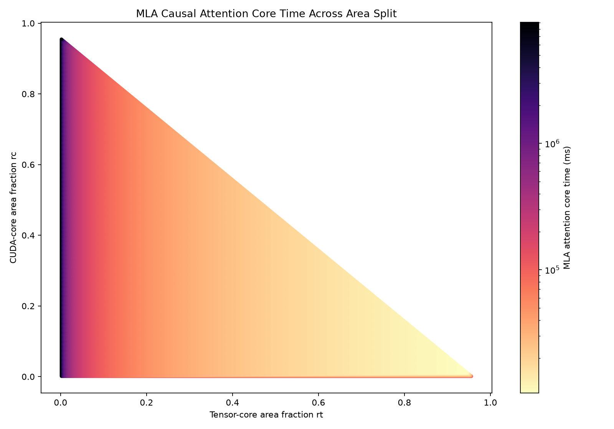

# Prefill Layer Area-Balance Report

## Assumptions
1. Workload is a GLM-5.2 **prefill** of a single 1,048,576-token prompt (batch = 1 sequence)
    - Whole prompt processed in one forward pass -> every GEMM's M = total tokens = 1,048,576
    - Experts: 256, Router Top-K: 8, Hidden: 6144, MoE Intermediate: 2048
    - Even routing: 32,768 tokens per expert (1,048,576 x 8 / 256)
    - Attention: Multi-head Latent Attention (MLA) with **DeepSeek Sparse Attention (DSA)**
        - Heads 64, kv_lora_rank 512, q_lora_rank 2048, qk_nope 192, qk_rope 64, v_head 256
        - Per-head Q/K width = 256; K/V materialized from the latent via the `mla_kv_b`
          up-projection (K_nope 192 + V 256 = 448 per head). No KV cache, no W_UK/W_UV absorption.
        - DSA (GLM-5.2 config.json): `index_topk` = **2048** selected keys per query, via a
          lightning indexer with `index_n_heads` = 32, `index_head_dim` = 128. The indexer
          scores all preceding tokens (dense O(S²), small heads) and selects the top-2048;
          the main MLA attention runs only over those (O(S·2048)). Causal, lower-triangle.
2. BF16 weights & activations
3. TSMC-12FFC logic (39.98 MTr/mm²), TSMC-N12-SHC SRAM (0.0864 μm²/bit)
4. A100-like cores: 0.2 / 6.0 MTr per CUDA / tensor core; 5.64 / 512 GFLOP/s per CUDA / tensor core;
   1410 MHz; HBM 500 cycles latency, 2.04 TB/s bandwidth
5. SwiGLU 8 FLOP/element; softmax 5 FLOP per score element

<!-- ## Formulas

```text
Every projection/FFN GEMM has M = tokens (= sequences * seq_len), so it is compute-bound:
  time = count * max(2*M*N*K / tensor_roof, traffic / BW_eff)

MLA attention core with DSA (fused flash, scores stay on chip):
  dense_entries = seq_len^2 * causal_factor                          (~S^2/2 per head)
  main_entries  = S*topk - topk*(topk-1)/2                           (selected keys/query, ~S*topk)
  tensor_ops = sequences * ( n_heads * 2 * main_entries * (qk_head + v_head)   # sparse MLA attn
             + 2 * index_n_heads * index_head_dim * dense_entries )            # lightning indexer O(S^2)
  cuda_ops   = sequences * ( softmax_flops * n_heads * main_entries            # softmax over selected
             + index_n_heads * dense_entries )                                 # indexer ReLU-gate/top-k
  time       = max(tensor_ops/tensor_roof, cuda_ops/cuda_roof, traffic/BW_eff)
  OI = ops / traffic  (huge -> compute-bound; the indexer's O(S^2) term dominates)
```
-->

## Workloads

| Stage | Kernel |
|---|---|
| Pre-attention RMSNorm | square-reduction |
| MLA Q down/up | mla_q_a, mla_q_b GEMM |
| MLA KV down (+RoPE key) | mla_kv_a GEMM |
| MLA KV up (materialize per-head K/V) | mla_kv_b GEMM |
| MLA attention core | fused **causal** flash self-attention over 1,048,576 tokens |
| MLA output proj | mla_o GEMM |
| Residual (post-attention) | residual add |
| Pre-FFN RMSNorm | square-reduction |
| Router | router GEMM |
| Up/Gate | up_gate GEMM x256 + SwiGLU |
| Down | down GEMM x256 |
| Expert combine | weighted sum over 1,048,576 tokens, top-k 8 |
| Residual (post-FFN) | residual add |

| GEMM | Shape | Count | Ops |
|---|---:|---:|---:|
| mla_q_a | M=1048576, N=2048, K=6144 | 1 | 26.38 TFLOP |
| mla_q_b | M=1048576, N=16384, K=2048 | 1 | 70.37 TFLOP |
| mla_kv_a | M=1048576, N=576, K=6144 | 1 | 7.42 TFLOP |
| mla_kv_b | M=1048576, N=28672, K=512 | 1 | 30.79 TFLOP |
| mla_o | M=1048576, N=6144, K=16384 | 1 | 211.11 TFLOP |
| router | M=1048576, N=256, K=6144 | 1 | 3.30 TFLOP |
| up_gate | M=32768, N=4096, K=6144 | 256 | 422.21 TFLOP |
| down | M=32768, N=6144, K=2048 | 256 | 211.11 TFLOP |

| Attention core (DSA, top-2048) | Ops | HBM traffic | OI |
|---|---:|---:|---:|
| Lightning indexer scoring (tensor, dense O(S²)) | 4.50 PFLOP | — | — |
| Sparse MLA attention QK+AV (tensor, O(S·topk)) | 0.14 PFLOP | — | — |
| softmax + indexer gate/top-k (CUDA) | 18.3 TFLOP | on-chip (fused) | — |
| **attention core total** | **4.64 PFLOP** | 136.0 GiB | 31,928 |

DSA shrinks the O(S²) main attention (36 PFLOP dense) down to the cheap lightning indexer
(**4.50 PFLOP** — same O(S²) but 1/8 the head width) plus a linear-in-S sparse attention (0.14 PFLOP):
a **~7.8× cut** in attention FLOPs. The indexer's O(S²) scoring now dominates the attention. For
reference, dense (no DSA) prefill is 36 PFLOP attention and 84.6 s/layer; the runs below use DSA.

## Graphs

| Total prefill-layer time | MLA causal attention core time |
|---|---|
|  |  |

## Area Results

| Model | Workload | rc | rt | SMEM frac | SMEM MiB | CUDA cores | Tensor cores | Time | Throughput |
|---|---|---:|---:|---:|---:|---:|---:|---:|---:|
| Latency-aware | Prefill layer (DSA) | 0.012 | 0.945 | 0.043 | 8.086 | 326 | 858 | 12,992 ms | 434.519 TFLOP/s |

Unlike decode, prefill runs at **435 TFLOP/s ≈ the tensor-core roof** (858 cores × 512 GFLOP/s =
439 TFLOP/s) — the layer is **compute-bound**, not memory-bound. The optimal split puts almost all area
in tensor cores (858) with a modest CUDA allotment (326) to keep the indexer's ReLU-gate/top-k and the
softmax (which run on CUDA cores) from becoming the bottleneck, and only ~8 MiB SMEM. (Dense, no-DSA,
prefill lands at the same split but 84,620 ms / 439 TFLOP/s.)

## Stage Results

| Stage/group | Time | HBM | OI |
|---|---:|---:|---:|
| pre_attention_rmsnorm | 6.318 ms | 12.004 GiB | 1.000 |
| mla_q_a | 60.210 ms | 100.000 GiB | 245.760 |
| mla_q_b | 160.560 ms | 288.000 GiB | 227.556 |
| mla_kv_a | 16.934 ms | 26.625 GiB | 259.606 |
| mla_kv_b | 70.245 ms | 120.027 GiB | 238.879 |
| **mla_attention (core, DSA)** | **10,571.914 ms** | **136.000 GiB** | **31,928** |
| mla_o | 481.679 ms | 908.000 GiB | 216.529 |
| post_attention_residual_add | 18.948 ms | 36.000 GiB | 0.167 |
| rmsnorm_square_reduction | 6.318 ms | 12.004 GiB | 1.000 |
| router | 7.526 ms | 14.000 GiB | 219.429 |
| up_gate (x256) | 963.357 ms | 1600.000 GiB | 245.760 |
| down (x256) | 481.679 ms | 864.000 GiB | 227.556 |
| activation | 63.960 ms | 96.000 GiB | 1.333 |
| expert_weighted_sum | 56.853 ms | 108.016 GiB | 0.833 |
| residual_add | 18.948 ms | 36.000 GiB | 0.167 |

MLA attention core at the best area node (**bottleneck = tensor**): tensor 10,572 ms (dominated by the
lightning indexer's O(S²) scoring), CUDA 9,941 ms (dominated by the indexer's ReLU-gate/top-k over the
S² scores), memory 72 ms. The tensor and CUDA paths are nearly equal — the analyzer picks 858 tensor /
326 CUDA cores so both finish together. All projection/FFN GEMMs are compute-bound (OI ≈ 220-260,
running at the tensor roof); their weight streaming is completely hidden. Note that with DSA the FFN
GEMMs (up_gate 963 ms, down/mla_o 482 ms) are now ~17% of the layer — no longer negligible as they were
in the dense case.

## Sensitivity Experiments

Area split re-optimized at each parameter value; all others held at baseline (bw 2.04 TB/s, latency
500 cyc, tensor 512 GFLOP/s/core, CUDA 5.64 GFLOP/s/core). **Total time tracks 1/tensor-throughput and
is essentially insensitive to bandwidth and latency** — the opposite of decode.

### Bandwidth Results
| HBM Bandwidth (TB/s) | CUDA cores | Tensor cores | Total Run Time (s) | Throughput (TFLOP/s) |
|---:|---:|---:|---:|---:|
| 1.02 | 326 | 858 | 13.130 | 429.95 |
| 2.04 | 326 | 858 | 12.992 | 434.52 |
| 4.08 | 326 | 858 | 12.969 | 435.30 |

Flat (1.2% over a 4× range). Halving bandwidth barely moves the time — attention is compute-bound and
its flash traffic (136 GiB) is trivially hidden.

### Latency Results
| HBM Latency (cycles) | Total Run Time (s) |
|---:|---:|
| 500 | 12.992 |
| 2000 | 12.992 |
| 4000 | 12.992 |

No effect.

### Tensor-core Throughput Results
| Tensor GFLOP/s/core | CUDA cores | Tensor cores | Total Run Time (s) | Throughput (TFLOP/s) |
|---:|---:|---:|---:|---:|
| 256 | 272 | 860 | 25.765 | 219.11 |
| 384 | 272 | 860 | 17.246 | 327.35 |
| 512 | 326 | 858 | 12.992 | 434.52 |
| 768 | 463 | 853 | 8.751 | 645.13 |
| 1024 | 626 | 848 | 6.641 | 850.13 |

**Total time is inversely proportional to tensor throughput** (time × throughput ≈ constant; throughput
linear: 219 → 850 TFLOP/s). This is the governing knob for prefill. As tensor throughput rises the
optimizer adds cheap CUDA cores (272 → 626) to keep the indexer's gate/top-k and the softmax from
becoming the new bottleneck.

### CUDA-core Throughput Results
| CUDA GFLOP/s/core | CUDA cores | Tensor cores | Total Run Time (s) | Throughput (TFLOP/s) |
|---:|---:|---:|---:|---:|
| 2.82 | 626 | 848 | 13.147 | 429.40 |
| 5.64 | 326 | 858 | 12.992 | 434.52 |
| 11.28 | 163 | 863 | 12.918 | 437.02 |

Nearly flat (±1%). The indexer's ReLU-gate/top-k and softmax run on CUDA cores and are nearly as costly
as the tensor work, but CUDA cores are cheap (0.2 vs 6.0 MTr), so the optimizer simply re-sizes the CUDA
allotment (626 → 163) to keep them balanced against the tensor path — total time stays tensor-bound.

## Conclusion — is prefill bandwidth-bottlenecked?

**No.** The GLM-5.2 prefill layer at 1M context is **compute (tensor-core) bound** — the exact opposite
of decode. Total time is inversely proportional to tensor-core throughput and essentially invariant to
HBM bandwidth and latency. This holds even with GLM-5.2's DeepSeek Sparse Attention (DSA, top-2048):
DSA cuts the attention FLOPs ~7.8× (36 → 4.64 PFLOP) and the whole layer from 84.6 s to **13.0 s**, but
the dominant cost becomes the lightning indexer's O(S²) scoring — still compute. The operational
intensity stays enormous (31,928 FLOP/byte) and the layer runs at ~435 TFLOP/s, right at the tensor
roof. The indexer's gate/top-k and softmax (on CUDA cores) are a near-equal co-bottleneck but are
cheaply balanced with extra CUDA cores. To speed up prefill you need more tensor-core FLOP/s; more HBM
bandwidth does essentially nothing.

**Decode vs. prefill (same GLM-5.2 layer, 1M context, DSA top-2048):**

| | Decode (batch 2048) | Prefill (1 prompt) |
|---|---|---|
| Dominant term | MLA KV-cache read (memory) | DSA lightning indexer O(S²) (compute) |
| Attention OI | 121 FLOP/byte | 31,928 FLOP/byte |
| Bottleneck | **HBM bandwidth** | **Tensor-core throughput** |
| Time ∝ | 1 / bandwidth | 1 / tensor-throughput |
| Insensitive to | latency, compute | latency, bandwidth |
| Layer time | 1.22 s | 13.0 s (84.6 s dense, no DSA) |
| Throughput | 246 TFLOP/s (below roof) | 435 TFLOP/s (≈ tensor roof) |
