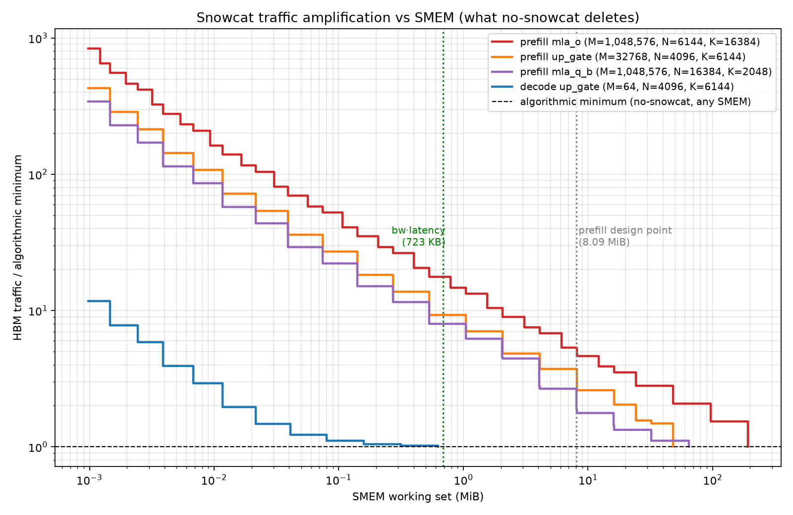
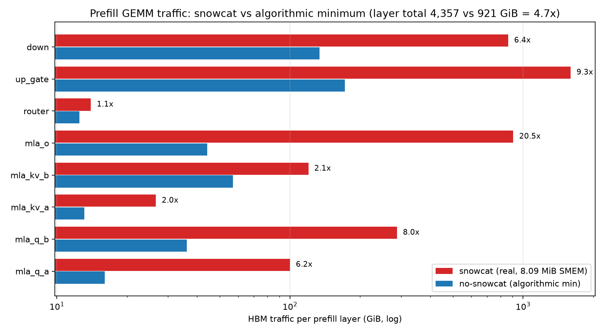
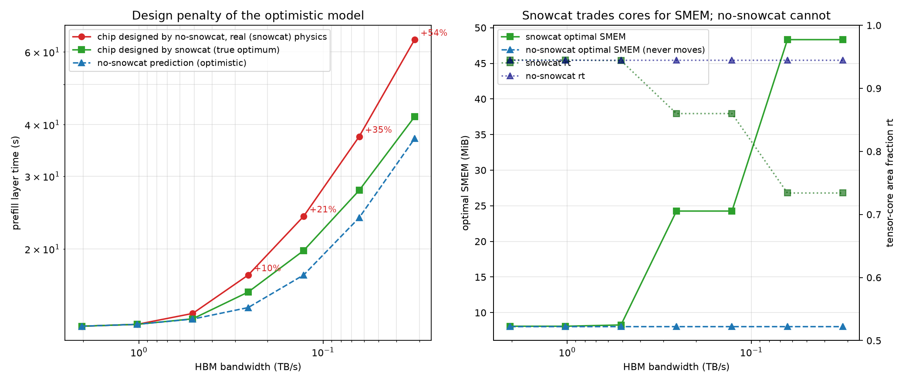
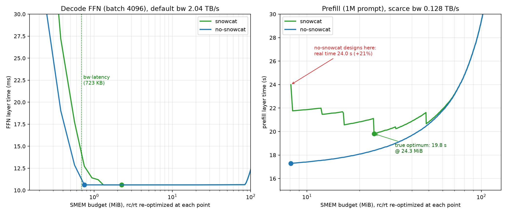
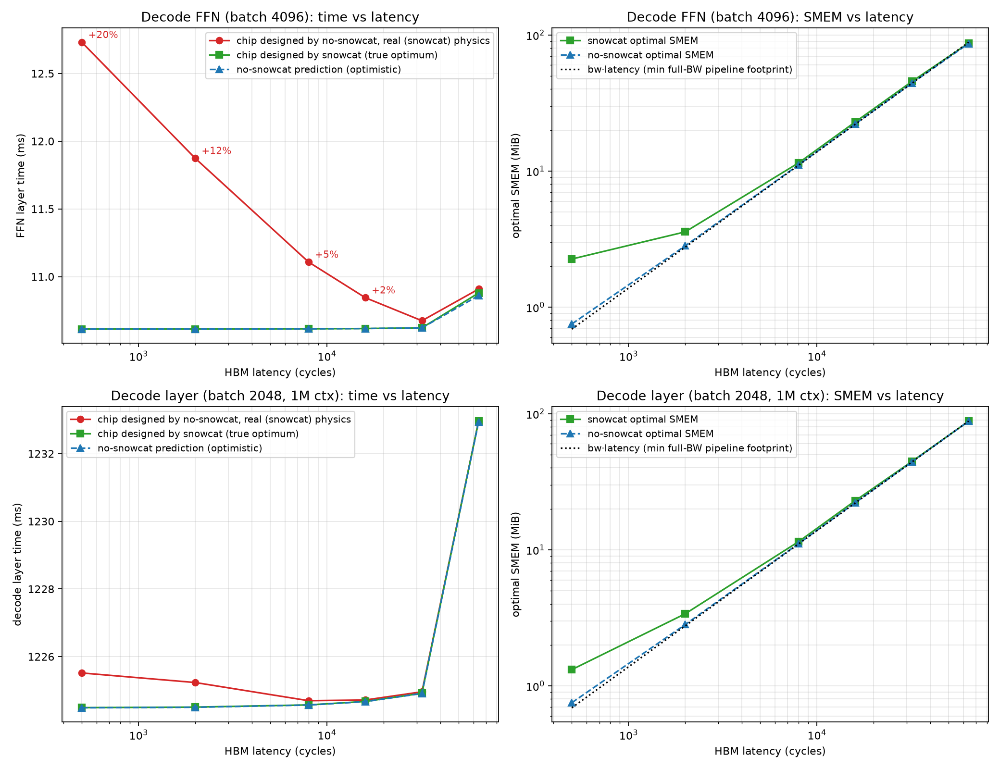

# Why the Snowcat Traffic Model Matters for Design Decisions

All numbers: GLM-5.2 single layer, A100-like cores, 2.04 TB/s HBM @ 500 cycles, BF16,
area grid step 0.001. Produced with the `--no-snowcat` mode of the analyzers
(`snowcat_mode_comparison.md` has the mechanics); both models re-optimize the
rc/rt/SMEM split unless stated otherwise.

**Claim.** Snowcat contributes exactly one term to the model: *HBM traffic as a function
of SMEM capacity*. Deleting it (algorithmic-minimum traffic, SMEM-independent OI) leaves
time predictions intact only while that term is off the critical path. The four facts
below locate where it is on the critical path — and show the optimistic model mispricing
time by up to 1.74× and silicon by up to +54% there.

## Fact 1 — GEMM traffic is a steep function of SMEM; no-snowcat deletes the entire curve

Traffic amplification (snowcat frontier ÷ algorithmic minimum) at given SMEM working sets:

| GEMM | 0.75 MiB | 2.26 MiB | 8.09 MiB | 24.3 MiB | 48.3 MiB | 96 MiB |
|---|---:|---:|---:|---:|---:|---:|
| prefill mla_o (M=1,048,576 × N=6144 × K=16384) | 17.7× | 9.0× | 5.3× | 2.8× | 2.1× | 2.1× |
| prefill up_gate (M=32768 × N=4096 × K=6144) | 9.3× | 4.8× | 3.7× | 1.6× | 1.0× | 1.0× |
| prefill mla_q_b (M=1,048,576 × N=16384 × K=2048) | 8.0× | 4.4× | 1.9× | 1.3× | 1.1× | 1.0× |
| decode up_gate (M=64 × N=4096 × K=6144) | 1.0× | 1.0× | 1.0× | 1.0× | 1.0× | 1.0× |

Amplification reaches 800× at KB-scale SMEM and stays 2–5× even at the 8 MiB design
point when all three GEMM dimensions are large. It is 1.0× at any SMEM ≥ 0.2 MiB for
decode-shaped (small-M, weight-streaming) GEMMs — the one case where no-snowcat is exact.

## Fact 2 — At the default design points the two models agree on time, but for two coincidental reasons

| Analyzer | snowcat time | no-snowcat time | Δtime | snowcat traffic | no-snowcat traffic | Δtraffic |
|---|---:|---:|---:|---:|---:|---:|
| FFN (batch 4096) | 10.613 ms | 10.613 ms | 0.00% | 20,645 MiB | 20,645 MiB | 0% |
| Fused FFN | 10.350 ms | 10.218 ms | −1.3% | 20,133 MiB | 19,877 MiB | −1.3% |
| Decode (batch 2048, 1M ctx) | 1,224.49 ms | 1,224.49 ms | −0.0004% | 2,381,989 MiB | 2,380,105 MiB | −0.08% |
| Prefill (1M prompt, DSA) | 12,992.39 ms | 12,992.39 ms | 0.00% | **4,461,236 MiB** | **943,062 MiB** | **−79%** |
| Inference (prefill + 150 decode) | 13,150.88 ms | 13,150.88 ms | 0.00% | — | — | — |

- Decode/FFN: memory-bound, but their GEMMs are decode-shaped → snowcat traffic *is* the
  algorithmic minimum (Fact 1, row 4) → identical times.
- Prefill: snowcat traffic is 4.7× the minimum, but the layer is tensor-bound → the
  amplification is hidden under compute → identical times, wildly different traffic:

Any traffic-derived quantity — DRAM energy, bandwidth headroom, multi-SM contention —
is understated 2–20× per stage (4.7× per layer) by the optimistic model, even where the
time agrees to the microsecond.

## Fact 3 — When memory-bound and SMEM-starved, the models diverge on time *and* on the design

Prefill pushed into the memory-bound regime by scaling bandwidth (both models re-optimize
the split at every point; "designed chip" = no-snowcat's recommended split evaluated
under snowcat physics):

| HBM bw (TB/s) | snowcat optimum | no-snowcat optimum | no-snowcat-designed chip | design penalty | fixed-chip prediction error |
|---:|---|---|---:|---:|---:|
| 2.040 | 12,992 ms (8.1 MiB, rt 0.945) | 12,992 ms (8.1 MiB, rt 0.945) | 12,992 ms | +0.0% | 1.00× |
| 1.020 | 13,130 ms (8.1 MiB) | 13,130 ms (8.1 MiB) | 13,130 ms | +0.0% | 1.00× |
| 0.510 | 13,541 ms (8.3 MiB) | 13,520 ms (8.1 MiB) | 13,953 ms | +3.0% | 1.03× |
| 0.255 | 15,720 ms (**24.3 MiB**, rt 0.860) | 14,417 ms (8.1 MiB) | 17,283 ms | +9.9% | 1.20× |
| 0.128 | 19,815 ms (24.3 MiB) | 17,291 ms (8.1 MiB) | 23,993 ms | +21.1% | 1.39× |
| 0.064 | 27,713 ms (**48.3 MiB**, rt 0.734) | 23,793 ms (8.1 MiB) | 37,414 ms | +35.0% | 1.57× |
| 0.032 | 41,807 ms (48.3 MiB) | 37,014 ms (8.1 MiB) | 64,257 ms | **+53.7%** | **1.74×** |

- **Prediction error (same chip):** at bw/64, the 8 MiB chip really takes 64.3 s; the
  optimistic model predicts 37.0 s — 1.74× under, approaching the traffic ratio.
- **Design error (the structural failure):** snowcat responds to bandwidth scarcity by
  trading cores for SMEM (8 → 24 → 48 MiB, rt 0.945 → 0.734). No-snowcat never moves —
  in that model SMEM has zero marginal value beyond the bw·latency streaming buffer
  (723 KB at the fixed 500-cycle latency of this sweep; see Fact 5 for the latency
  axis) — and the chip it recommends is +54% slower than the snowcat-informed design.
  The penalty grows monotonically with bandwidth scarcity; the same divergence appears
  if tensor throughput rises instead of bandwidth falling (any compute:bandwidth ratio
  ≳ 8× the A100-like baseline).

## Fact 4 — Snowcat is the only source of SMEM's *reuse* value in the area trade-off

Best achievable time vs SMEM budget (rc/rt re-optimized at every point):

- Left (memory-bound FFN, default bw): the models diverge below ~2 MiB — no-snowcat
  claims a 0.75 MiB chip matches a 2.3 MiB one (10.61 ms); snowcat shows +23% at
  0.75 MiB (13.0 vs 10.6 ms) and the gap exploding below that. The optimistic model
  renders the entire low-SMEM region of every area map falsely flat.
- Right (memory-bound prefill, bw/16): no-snowcat's curve is *monotonically increasing*
  — it prices SMEM as pure waste and pins the design at the 8 MiB attention-tile floor.
  Snowcat's curve has a valley at 24.3 MiB (19.8 s); the no-snowcat design point really
  costs 24.0 s (+21%). An SMEM↔cores trade-off worth 21–54% of performance is
  *invisible in principle* to the algorithmic-minimum model.

One further structural error: the no-snowcat fused-FFN minimum assumes the SwiGLU
intermediate stays on chip regardless of size — 512 KB/expert at the decode default
(plausible) but 128 MiB/expert at prefill scale (physically impossible at any split);
snowcat's working-set feasibility check is what catches this class of fiction.

## Fact 5 — SMEM demand has a second component: `num_stages` copies of the tile working set. It is mode-independent, so the models *converge* under latency scarcity

In the snowcat latency model, SMEM holds `C = num_stages` simultaneous copies of the
tile working set W (`C·W ≤ SMEM`, `BW_eff = min(bw, C·W/latency)`): higher latency
demands more in-flight copies, and this pipelining footprint competes with using SMEM
for reuse (larger W). HBM-latency sweep on the two memory-bound workloads (both models
re-optimized per point; snowcat's winning up_gate tiling shown):

| HBM latency (cyc) | bw·latency | snowcat optimum | no-snowcat optimum | up_gate tile W | C | C·W | design penalty | fixed-chip pred. error |
|---:|---:|---|---|---:|---:|---:|---:|---:|
| 500 | 0.69 MiB | 10.613 ms (2.26 MiB) | 10.613 ms (0.75 MiB) | 1,156 KiB | 1 | 1.13 MiB | **+20.0%** | **1.20×** |
| 2,000 | 2.76 MiB | 10.613 ms (3.57 MiB) | 10.613 ms (2.82 MiB) | 1,156 KiB | 3 | 3.39 MiB | +11.9% | 1.12× |
| 8,000 | 11.04 MiB | 10.615 ms (11.47 MiB) | 10.615 ms (11.09 MiB) | 1,156 KiB | 10 | 11.29 MiB | +4.6% | 1.05× |
| 16,000 | 22.08 MiB | 10.617 ms (22.94 MiB) | 10.617 ms (22.19 MiB) | 1,156 KiB | 20 | 22.58 MiB | +2.1% | 1.02× |
| 32,000 | 44.15 MiB | 10.622 ms (45.51 MiB) | 10.622 ms (44.19 MiB) | 1,156 KiB | 40 | 45.16 MiB | +0.5% | 1.01× |
| 64,000 | 88.31 MiB | 10.879 ms (87.06 MiB) | 10.860 ms (86.50 MiB) | 1,156 KiB | 77 | 86.93 MiB | +0.3% | 1.00× |

(FFN, batch 4096. Decode layer, batch 2048/1M ctx: same SMEM trajectory 1.3 → 88 MiB
in both models, times 1,224.5 → 1,233.0 ms, design penalty ≤ +0.1% at every latency —
its dominant KV-stream/attention pipeline model is mode-identical.)

- **The flagged mechanism, confirmed directly:** snowcat hides latency by replicating
  the *same* min-traffic 1,156 KiB tile — W never changes, `C` scales 1 → 77, and
  `C·W` tracks bw·latency to within one tile. SMEM demand therefore decomposes into
  **reuse (W, mode-dependent) + pipelining (C·W ≈ bw·latency, mode-independent)**.
- **Both models' optimal SMEM scales with latency** (no-snowcat 0.75 → 86.5 MiB) — the
  "no-snowcat SMEM never moves" behavior of Fact 3 is a fixed-latency artifact. For
  *latency-driven* SMEM sizing, no-snowcat is accurate to O(one tile): bw·latency
  dominates and is the same physics in both models.
- **Latency scarcity makes the models converge; bandwidth scarcity makes them diverge**
  (design penalty +20% → +0.3% as latency grows 128×, vs +0% → +54% as bandwidth falls
  64× in Fact 3). Once bw·latency ≫ W, any SMEM that hides latency automatically fits
  many copies of the min-traffic tile, so the reuse term is satisfied for free.
- **The largest error is at the *default* 500-cycle point:** no-snowcat's 0.75 MiB pick
  cannot fit the 1.13 MiB min-traffic tile, so under real physics the chip pays
  amplified up_gate traffic — +20.0% on this memory-bound layer. The reuse term, not
  the latency term, is what the optimistic model gets wrong.
- Time itself is latency-insensitive in both models when SMEM is re-optimized
  (10.613 → 10.879 ms across 128× latency): buying bw·latency of SMEM stays cheap
  until it displaces half the cores (88 MiB = 46% of die at 64k cycles, rt 0.97 → 0.52).

## Conclusions

| Question asked of the model | No-snowcat verdict | Requires snowcat? |
|---|---|---|
| Time, compute-bound workload (prefill @ 2 TB/s) | exact (0.00%) | no |
| Time, memory-bound with weight-streaming GEMMs (decode, FFN, ≥ 2 MiB SMEM) | exact (≤0.08%) | no |
| Time, memory-bound with large-operand GEMMs or SMEM below the min-traffic tile | **up to 1.74× under** | **yes** |
| HBM traffic / DRAM energy / bandwidth headroom | **2–20× per stage under (4.7×/layer)** | **yes** |
| SMEM for latency hiding (pipelining footprint `C·W ≈ bw·latency`) | accurate to O(one tile) at every latency (Fact 5) | no |
| SMEM for data reuse (traffic reduction via tile size W) | **priced at zero — +20% design penalty even at the default 500-cycle point** | **yes** |
| Core↔SMEM area allocation under bandwidth scarcity | **+10% to +54% silicon misallocation** | **yes** |

The algorithmic-minimum model is a valid *lower bound on traffic* and *upper bound on
what better tiling could ever recover* (≤1.3% of time at the baseline design points),
and — per Fact 5 — it prices SMEM's *pipelining* value (num_stages copies of the tile
working set, ≈ bw·latency, mode-independent) correctly. What it deletes is SMEM's
*reuse* value, the curve traffic(SMEM): every question that involves sizing SMEM for
reuse, pricing bandwidth, or accounting for memory traffic gets its answer from that
curve. The baseline agreement between the models is a property of this particular
workload/chip ratio — not of the optimistic model — and it evaporates exactly where
the design decisions become non-trivial: scarce bandwidth (diverging, up to +54%) and
SMEM budgets near or below the min-traffic tile (+20% at the default operating point).
